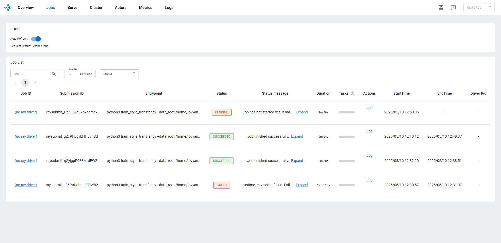
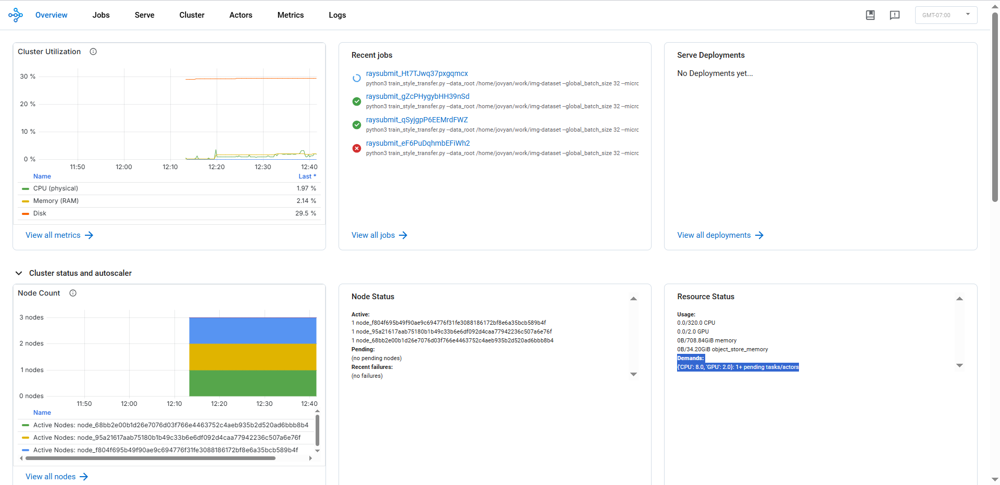

# Model Training Overview

## Directory Structure

```bash
.
├── README.md                  # Main presentation entry (this file)
├── README_proposal.md         # Initial training proposal
├── imgs/                      # Intermediate results, visual outputs from experiments
├── models/                    # Trained PyTorch models (.pt)
├── train/                     # Training scripts in Python
├── large_scale_train_index.md # Large-scale training settings, logs and provisioning steps
├── ray_train.md               # Instructions for Ray + ROCm-based training
├── cloud_deploy.md            # Web service deployment on Chameleon Cloud
├── vision-to-vintage-app/    # Frontend + Backend for web app
```

---

## Modeling (Training Methods)

Refer to my training code at [train\_style\_transfer.py](https://github.com/M0n4GPT/vision-to-vintage/raw/master/style_transfer/train_style_transfer.py)

The task is framed as a multi-class style transfer problem using the AdaIN technique. The inputs for the trained model are:

- A **content image** (user-provided)
- A **style label** (e.g. "Picasso_xxx")

The output is a stylized version of the content image, reflecting the chosen style class.

This setup supports our customer-facing web app, where users can upload their own images with any contents they insterested in. And from 50 labels of artist styles that have been trained in our models from the dataset, the model randomly selects one style and outputs a transformed image in that artistic style, while preserving the original content of the uploaded image and only altering its style. This forms the basis of our interactive web application, where users are encouraged to guess which style the model applied. Their guesses are compared to the actual selected style to generate feedback, which serves as an indicator of how recognizable and effective the model's style transformation is.

### Model Architecture

- **Encoder**: Pretrained `VGG19` feature extractor, frozen early layers and unfrozen deeper layers
- **Style Transfer Layer**: AdaIN layer that aligns mean and std of content features to style features
- **Decoder**: A multi-layer ConvNet that reconstructs RGB images

#### **Encoder**: Pretrained VGG19

- Partially unfreeze `block5_conv1` to `block5_conv4`, which gives us around **10M trainable parameters** in the encoder alone
- These deeper layers learn to adapt style-specific semantics while keeping low-level features frozen

#### **AdaIN Layer**: Adaptive Instance Normalization to merge content and style features:

- Aligns the statistics of content features to style features
- Enables blending content and style with no need for separate style-specific networks

```python
t = (c_feat - mean(c_feat)) / std(c_feat) * std(s_feat) + mean(s_feat)
```

#### **Decoder**: Upsampling convolutional network

- Reconstructs RGB image from AdaIN output
- Contains ~3M parameters

**Total trainable parameters**: ~13–15M

It's powerful enough to learn diverse styles while remaining lightweight and stable for training and deployment.

### Why use VGG19 and why use it in this way

VGG19 is a deep convolutional neural network originally trained for image classification. In order to classify images, it has to build a rich internal representation of visual content — from edges and textures to full object structures. This makes it an ideal **feature extractor**.

- The **early layers** of VGG19 capture low-level visual features like **edges, lines, and colors**.
- The **deeper layers** capture high-level semantic information like **object shapes, structures, and spatial layout**.

This hierarchical structure makes it possible to separate:

- **Content** — “what's in the image” (captured in deep layers)
- **Style** — “how it looks” (captured in shallow layers)

### How this Style Transfer Works

For a given input image,

- Use an intermediate **deep layer** (e.g., `block5_conv2`) to represent **content**
- Use several **shallow to mid layers** (e.g., `block1_conv1` to `block5_conv1`) to extract **style** (textures and visual patterns)

Then, through **Adaptive Instance Normalization**, align the statistical properties (mean and standard deviation) of the content features to match those of the style features. This gives us a transformed feature map that **preserves the structure of the original image** while adopting the **style of the target image**.

---

## **Train and re-train**

### Train

All training scripts are located in the `train/` directory. Run the train process by:

```bash
python train_style_transfer.py \
  --data_root "$IMG_DATA_DIR" \
  --global_batch_size 32 \
  --epochs 20 \
  --strategy ddp \
  --export_path ./stylizer.pt
```

### Re-train

To retrain the model, we already have:

- The `train_style_transfer.py` script
- A previously trained `.pt` model
- new Content or new style images structured into folders
- then run following comend:

```bash
python train_style_transfer.py \
  --fine_tune \
  --pretrained_model ./stylizer.pt \
  --data_root "$IMG_DATA_DIR" \
  --export_path ./stylizer_retrained.pt \
  --strategy ddp \
  --epochs 5 \
  --precision fp32
```

#### Why this Retraining setup is Reasonable

In my current setup, both retraining shares the same strategy with training, it's maily because since we reuse the same training script, optimizer, loss functions, and data pipeline, retraining remains stable, consistent, and reproducible. With just two flags (`--fine_tune` and `--pretrained_model`), the model can resume from any previous checkpoint and continue learning with new data, adjusted batch sizes, or updated style classes. This approach is fully compatible with Ray for job scheduling and MLflow for experiment tracking, and it supports fine-tuning by allowing parts of the encoder to be selectively unfrozen.

---

## Experiment tracking + Training strategies for large models + Use distributed training to increase velocity

For a complete walkthrough of my training setup and reproduction steps, please refer to [this detailed training guide](https://github.com/M0n4GPT/Vision-to-Vintage-AIs-Take-on-Classical-Art/blob/main/ModelTraining/large_scale_train_index.md).

### Summary of Training Strategies and Distributed Setup

- **Large Batch Handling**: Controlled using `--global_batch_size` and `--micro_batch_size` to balance memory and convergence.
- **Mixed Precision Training**: Enabled `amp` (automatic mixed precision) to speed up computation and reduce memory usage.
- **Distributed Strategy**:
  
  - Initially used 1GPU. Then switched to `torchrun` for improved compatibility with PyTorch's latest practices.
  - Use DDP and FSDP strategy for synchronized multi-GPU training.
- **Platform**: Ran training jobs on an AMD MI100 bare-metal server via Chameleon Cloud.
- **Containerization**: Built Docker image with ROCm, PyTorch, MLFlow, and Jupyter for reproducibility and consistency.

### MLFlow Tracking

- Tracked gpu usage, training loss, and evaluation metrics using MLFlow.
- Hosted MLFlow UI at port 8080 on the VM node, using floating IP to communicate with the tracking server.
- Experiment artifacts and logs were stored on block storage then.

### Training Metrics for Different Strategies

All intermediate results and screenshots captured during the experiment runs have been uploaded to the `imgs` folder. [Link](https://github.com/M0n4GPT/Vision-to-Vintage-AIs-Take-on-Classical-Art/tree/main/ModelTraining/imgs) Here I've compiled some data from those results to reflect the impact of different training strategies.

*To improve experimental efficiency, these tests were conducted on a small subset of the dataset. However, the code structure remained unchanged. Below is a summary of the experimental results.*

#### Reduced batch size/Gradient accumulation

Training time per epoch remained consistent at **\~70 seconds** when using smaller or moderately-sized batch settings (Experiment 2 and 4), but **increased slightly to 77 seconds** in Experiment 3 due to the high memory load from setting both `global_batch_size` and `micro_batch_size` to 128.

* **Experiment 2** (micro: 8, global: 32) — 70s/epoch, \~1.07 GB memory
* **Experiment 3** (micro: 128, global: 128) — 77s/epoch, \~15.3 GB memory
* **Experiment 4** (micro: 32, global: 32) — 70s/epoch, \~3.9 GB memory
* **Experiment 5** (micro: 32, global: 128) — 67s/epoch, \~3.91 GB memory

This suggests that while large batch sizes impose a much higher memory cost, making smaller micro-batches more efficient for single-node runs. Carefully tuning the balance between global and micro batch sizes can allowe better GPU utilization without overwhelming memory.

#### Mixed precision

In Experiment 6, we enabled mixed-precision training using `--precision amp`, while keeping the same batch configuration as Experiment 5:

* **Experiment 5** (--precision fp32) — 67s/epoch, \~3.91 GB memory, total_loss ~0.21
* **Experiment 6** (--precision amp) — 34.5s/epoch, \~2.37 GB memory, total_loss ~0.26


Mixed precision significantly reduced memory usage and **cut training time in half** compared to the full-precision run in Experiment 5. However, this came with a slight degradation in training quality, as reflected in a higher total loss.

This demonstrates the practical benefit of AMP in accelerating training while preserving quality, especially valuable in resource-constrained environments.

#### Distributed Training with 2x gpu\_mi100 DDP

* **Experiment 6** (none) — 34.5s/epoch, \~2.37 GB memory
* **Experiment 7** (DDP) — 22.1s/epoch,  \~2.38 GB per GPU memory

DDP allowed us to cut training time by more than a third compared to single-GPU AMP training, with almost the same in memory usage.

This result confirms the effectiveness of combining AMP and DDP for large-scale model training: AMP reduces memory and speeds up computation, while DDP parallelizes the workload across GPUs to fully utilize available hardware.

#### Distributed Training with 2x gpu\_mi100 FSDP

* **Experiment 7** (DDP) — 22.1s/epoch,  \~2.38 GB per GPU memory
* **Experiment 8** (FSDP) — 21.9s/epoch,  \~2.33 GB per GPU memory

Compared to DDP, the memory was saved, and the training time remained nearly identical.

Why didn't FSDP yield larger memory savings? In our case, The encoder is partially frozen or partially trainable (small parameter size), and AdaIN introduces no additional large state. As a result, **there was little memory pressure for FSDP to alleviate**, and its benefits were limited.


## ​Scheduling training jobs​ + Using Ray Train

See [ray_train.md](https://github.com/M0n4GPT/Vision-to-Vintage-AIs-Take-on-Classical-Art/blob/main/ModelTraining/ray_train.md) for full Ray cluster setup and job instructions.

To support large-scale and reproducible training, I integrated Ray Train in my computing instance. This allows us to submit training and retraining jobs to a Ray cluster running on two GPU-equipped worker nodes.

### Key Features:

- **Runtime Environment Setup**: Uses `runtime.json` and `requirements.txt` to install dependencies and configure env variables.
- **Job Submission**: Training is launched via `ray job submit` specifying resources (e.g., 1 GPU + 8 CPUs), environment, and command.
- **Resilience**: In case of node failure, Ray allows restarting jobs with preserved checkpoints via MinIO object storage.
- **Monitoring**: The Ray Dashboard (port 8265) enables real-time visualization of job status, logs, and resource allocation.

Below is some snapshots of the Ray Cluster Dashboard UI captured during training, showcasing the live status of submitted jobs, resource utilization, and active workers.






